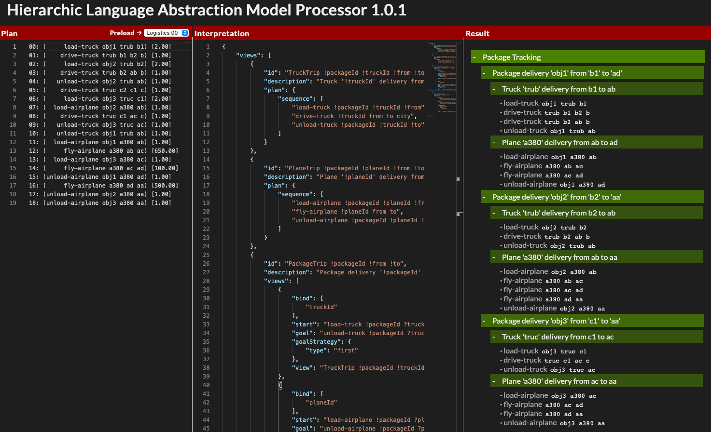

# Hierarchic Language Abstraction Model

### TL;DR;

* Watch the video below
* Go to [http://hlam.trescak.co](http://hlam.trescak.co) and have some fun with our HLAM model

### Abstract

Explainable planning systems facilitate understanding of system decisions and challenge them through investigatory dialogue, with social, selective and contrastive explanations. When aiming at end-user explanations systems often require capturing and communicating the complexities of the problem domain from various perspectives. But, the existing approaches are limited by generating explanations using a language consisting only of domain actions and variables, hindering expressivity. Our approach1 defines higher-level hierarchic abstractions composed of domain actions and variables, facilitating the interpretation of plan actions from various perspectives. Using abstractions, we can map the end users’ domain knowledge, language and interests onto the plan problem domain. Moreover, organising a hierarchy of interpretations facilitates systematic decomposition from high-level perspectives to individual actions or activities.


Tutorial video for the HLAM system


### Introduction

Explainable AI Planning (XAIP) systems are maturing, with a substantial body of work focusing on delivering robust planning systems that use explanations to help users understand and challenge system decisions. The explanations that systems generate differ based on the approach and target audience (Zhang et al. 2017). A planning algorithm designer is more interested in the low-level performance of the algorithm, where explanations relate to debugging activities of the programming world. Here, every instruction of the planning algorithm is essential and often, it is an algorithm itself that provides textual or even visual explanations of its inner workings (Magnaguagno et al. 2017).

The situation is different for end-users of planning systems. They are not interested in the inner working of planning algorithms but rather try to comprehend why a proposed planning scenario is their best option and what would happen if the system would consider a different alternative (Chakraborti, Sreedharan, and Kambhampati 2020). The planning system adjusts the constraints based on user input and then generates a new outcome and communicates further explanations (Fox, Long, and Magazzeni 2017). This process can occur on the model level (Chakraborti, Sreedha-ran, and Kambhampati 2020), constraining the model and analysing the outcome, or even on the plan level, exploring the generated plans and potentially adapting and reusing them in similar scenarios (Hammond 2012).

This paper presents the HLAM - Hierarchic Language Abstraction Model, an end-user system delivering model-based and partially plan-based explanations. We assume that end-users of planning systems play different roles and have various levels and domains of knowledge. For example, considering a logistics planning scenario, an end-user of the planning system can be a dispatcher, a driver or even a client. To accommodate various end-user explanations, we propose to use language abstractions (i.e. interpretations) that facilitate plan understanding and deliver the possibility for more expressive explanations in natural language.

### Hierarchic Language Abstraction Model (HLAM)

We have [implemented the HLAM as a Java library](https://github.com/tomitrescak/pddl4j), currently used with [PDDL4J library](https://github.com/pellierd/pddl4j). We have also [developed a Javascript library](https://github.com/tomitrescak/hlam) with [a web application](http://hlam.trescak.co) demonstrating the capabilities of our model. This application automatically generates a graphical representation of hierarchic abstractions, allowing you to drill down to the details of your plan.



Figure 2 depicts the web interface of the HLAM interpreter. On the left, you specify the plan you wish to pro- cess. You can also preload one of the example scenarios from well-known planning domains. In the centre of the screen, you create (or preload) the interpretation model in the JSON format. On the right, you can see the generated HLAM model displayed as the hierarchic tree view. You can collapse or expand each of the abstractions. While we create the output of our model in a tree structure, it is essential to note that the model is intrinsically defined as an oriented graph, able to capture complex dependencies between abstractions.

```json
{
 "id": "PackageDelivery",
 "description": "Package Tracking",
 "views": [{
  "start": "load-plane ?id p ?pf",
  "goal": "unload-plane !id p ?pt",
  "strategy": "final",
  "child": "PackageTrip !id !pf !pt"
 }]
},
{
 "id": "PackageTrip !id !f !t",
 "description": "Package delivery '!id' from '!f' to '!t'",
 "views": [{
  "start": "load-plane !id ?p ?pf",
  "goal": "unload-plane !id !p ?pt",
  "strategy": "first",
  "child":"PlaneTrip !id !p !pf !pt"
 }]
},
{
  "id": "PlaneTrip !id !p !f !t",
  "description": "Plane '!p' delivery from '!f' to '!t'",
  "plan": {
    "sequence": [
      "load-plane !id !p !f",
      "fly-plane !p f t",
      "unload-plane !id !p !t"
    ]
  }
}
```

The graph-like structure of our model is clear from the definition of the HLAM model, where abstraction concepts (i.e. views) are defined all in one level, using references to child concepts rather than in a tree. The code listing above lists an excerpt from the JSON representation of the model for the logistics domain:

Please note the main parts of the HLAM model. The `PackageDelivery` and `PackageTrip` represent hierarchic abstractions (i.e. have child abstractions `PlaneTrip`) of the HLAM hierarchy, and `PlaneTrip` extract and interprets sub-plans. The PackageDelivery has no parameters but extracts individual package journeys from the plan. Please note that we used the ”final goal” strategy, selecting the last possible unload-plane line, and detecting the last destination. The selected sub-plan for each extracted package journey, along with the list of bound variables is passed to the PackageTrip abstraction. This abstraction uses the "first goal" selection strategy, extracting individual legs of the package journey. It has three parameters:

1. `!id` - packageId
2. &#x20;`!f` - source (from) destination of the package&#x20;
3. !t - target (to) destination of the package

As we explain in the tutorial video, the abstraction binds and passes values of parameters to their child abstractions. In this case, the PackageDelivery binds the `?id` and `?pf` value when detecting the the start line `load-plane ?id p ?pf`. Detection of goal line `unload-plane !id p ?pt` is using the bound value of package !id and binding a `?pt` value. Values of `id, pf` and `pt` are then used to create the PackageTrip !id !pf !pt abstraction.

Similarly, in the `PackageTrip` we consider the start line to be `load-plane !id ?p ?pf`, using the bound value of package `!id` and binding two new values: the plane p, and a source destination of the plane delivery pf. The goal, is the first matching line with `unload-plane !id !p ?pt`, where package `!id` and plane `!p` are bound (i.e. must be the same as in the start line), and we bind a new value `?pt`, representing the target destination of this plane trip.

The model then calls the PlaneTrip child abstraction, with the bound value of `!id` coming from the parent node, and newly bound values `!p, !pf, !pt`. The `PlaneTrip` represents a target sub-plan selection, which selects individual plan lines. An interesting fact of this example is, that we are able to extract all individual plane trips with our package on board, starting with loading the package on board with `load !id !p !f`, considering all plane `!p` trips (note the use of unbound values for from f and to t destinations), until our package `!p` is unloaded from the aeroplane.

### Extending HLAM

Our model considers classical planning systems but otherwise is model and domain-independent. The design of the model allows extending its functionality to consider more complex scenarios. We are currently working on an ex- tension that brings LIME-like (Ribeiro, Singh, and Guestrin 2016) approach to planning systems explanations. This extension will consider multiple plans, performing a probabilistic analysis of outcomes. This will permit the system to report conclusions such as ”if you consider action A instead of B, with 80% probability it will yield to C and with 90% probability it will yield to D”.

### References

Chakraborti, T.; Sreedharan, S.; and Kambhampati, S. 2020. The Emerging Landscape of Explainable AI Planning and Decision Making. arXiv.

Fox, M.; Long, D.; and Magazzeni, D. 2017. Explainable Planning. arXiv.

Hammond, K. J. 2012. Case-based planning: Viewing planning as a memory task. Elsevier.

Magnaguagno, M.; Pereira, R. F.; Mo ́re, M. D.; and Meneguzzi, F. 2017. WEB PLANNER: A Tool to Develop Classical Planning Domains and Visualize Heuristic State- Space Search. In ICAPS Workshop on User Interfaces and Scheduling and Planning.

Ribeiro, M. T.; Singh, S.; and Guestrin, C. 2016. ”Why Should I Trust You?”: Explaining the Predictions of Any Classifier. In Proceedings of the 22nd ACM SIGKDD International Conference on Knowledge Discovery and Data Mining, KDD ’16, 1135–1144. New York, NY, USA: Association for Computing Machinery. ISBN 9781450342322.

Zhang, Y.; Sreedharan, S.; Kulkarni, A.; Chakraborti, T.; Zhuo, H. H.; and Kambhampati, S. 2017. Plan explica- bility and predictability for robot task planning. In 2017 IEEE International Conference on Robotics and Automation (ICRA), 1313–1320.
